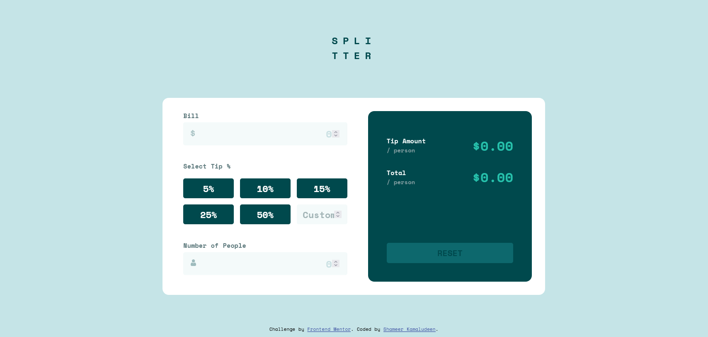

# Frontend Mentor - Tip calculator app solution

This is a solution to the [Tip calculator app challenge on Frontend Mentor](https://www.frontendmentor.io/challenges/tip-calculator-app-ugJNGbJUX). Frontend Mentor challenges help you improve your coding skills by building realistic projects.

## Table of contents

- [Overview](#overview)
  - [The challenge](#the-challenge)
  - [Screenshot](#screenshot)
  - [Links](#links)
- [My process](#my-process)
  - [Built with](#built-with)
  - [What I learned](#what-i-learned)
  - [Continued development](#continued-development)
- [Author](#author)

## Overview

The challenge is a little more focused on javascript from the previous challenges. Some calculation is addition to this challenge which helps familiarize the arithmetic operations in javascript, along with that we can practice plenty of layout and element designs.

### The challenge

Users should be able to:

- View the optimal layout for the app depending on their device's screen size
- See hover states for all interactive elements on the page
- Calculate the correct tip and total cost of the bill per person

### Screenshot

### Links

- Solution URL: [Click here](https://github.com/shameerkamaludeen/tip-calculator-app)
- Live Site URL: [Click here](https://shameerkamaludeen.github.io/tip-calculator-app/)

## My process

### Built with

- Semantic HTML5 markup
- Flexbox
- CSS Grid
- Mobile-first workflow

### What I learned

I have concentrated on some advanced level validation making clear with the validation properly and focused responsiveness a little more accurately.

### Continued development

The main focus in the future will be on accessibility, even though I used to practice accessibility while coding but still some are missing because those issues are unknown to me, so accessibility knowledge will be helpful on that. 

## Author

- Github - [Shameer Kamaludeen](https://github.com/shameerkamaludeen)
- Frontend Mentor - [@shameerkamaludeen](https://www.frontendmentor.io/profile/shameerkamaludeen)